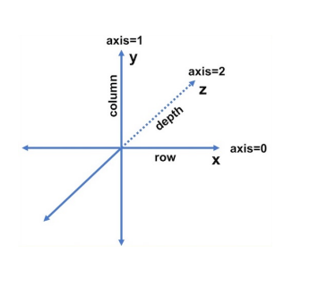

# 2. 의미있는 이름 짓기

1. 의미 있는 이름 짓기 

```jsx
// 의미 없이 a, b로 이름 짓지 말아야 한다. 
int a;
String b;
System.out.printf("user Requested %s count = %d", a,b);

//구체적인 이름을 넣어서 변수 이름을 지어야한다. 
int itemCount;
String intemName;
System.out.printf("user Requested %s count = %d", intemName,intemName);

// 클라스를 사용하여 의미를 명확하게 사용할수 있다 . 
class SalseItem{
	ItemCode code;
	int count;
	String name;
} 

SalseItem selectedItem = salesItemRespository.getItemByCode(purchaseRequest.getItemcode());
System.out.printf("user Requested %s count = %d", selectedItem.getName,selectedItem.getCode());

```

1. 루프속에 i,j,k 사용하지 않기 

```jsx
// 배열을 순회 할 때 index를 의미하는 i를 사용하지 않고 advanced for문으로 대체할 수 있다
for(int i = 0; i < messages.size(); i++){} => for(message : meassages){}

// 람다식 
messages.stream.forEach(message-> //...)
```

i,j,k 대신 맥락있는 이름 사용하기 

i,j → row, col / width, height                                            

i,j,k → row, col, depth 



3, 통일성 있는 단어 사용하기 

똑깥은 의미에는 똑같은 단어를 사용하는것이 중요 하다. 

Member / Customer / User  

Service/ Manmger

Repository / Dao등 

같은 의미의 단어는  팀에서 협의 해서 하나의 단어를 사용해야 한다. 

1. 변수명에 타입을 넣지 않기 
    
    ```jsx
    String nameString -> name
    int itemPriceAmount -> itemPrice
    
    Account[] accountArray -> accounts
    Account[] accountArray -> accounts
    List<Account> accountList -> accounts, accountList
    Map<Account> accountMap
    public interface IShapeFactory -> ShapeFactory
    public class ShapeFactoryImpl -> CircleFactory
    
    ```
    
2. Google Java Naming Guide
    
    A. Package Naming Guide
    
    All lower case no under scores
    
    ```jsx
    com.example.deepspace (o)
    com.example.deepSpace (x)
    com.example.deep_space(x)
    ```
    
    b. Class Naming Guide 
    
    unpper CamelCase(대문자 카멜케이스 )
    
    ```jsx
    // 클래스는 명사, 명사구
    Character, ImmutableList
    
    // 인터페이스는 명사
    List, Readable
    
    // 테스트 클래스는 Test 로 끝내기
    HashTest, HashIntegrationTest
    ```
    
    c. Method Naming Guide 
    
    LowerCamelCase (소문자 시작)
    
    ```jsx
    메소드는 동사 동사구로 시작 
    sendMessage, stop
    
    //jUnit 테스트에 underscore 사용되기도 함
    // <methodUnderTest>_<state> 패턴
    pop_emptyStack
    ```