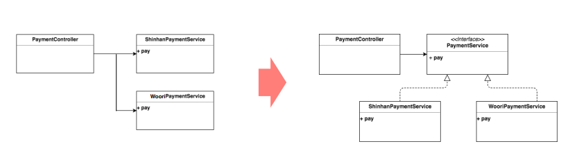

# 3.함수를 완전하고 간결하게 짓기

1.SOLID

1. SRP 단일 책임 원칙 : 클라스는 하나의 기능만 가지며, 어떤 변화에 의해 클래스를 변경해야하는 이유는 오직 하나뿐이어야 한다. 
    - SRP 책임이 분명해지기 때문에, 변경에 의한 연쇄 작용에서 자유로워질 수 있다.
    - 가독성 향상과 유지 보수가 용이
2. OCP 개방-패쇄 원칙 : 확장에는 열려 있으나 변겨에는 닫혀있어야 한다. 
    - 요구사항의 병경이나 추가 사항이 발생하더라도, 기존 구성요서에는 서정이 일어나지 않고 기존 구성 요소를 쉽게 확장해서 재 사용한다.
    - 추상화화 다형서을 활용한다.
3. LSP 리스코프 치환 원칙 : 서브 타입은 언제나 기반타입으로 교체 할수 있어야 한다. (부모크라스나 인터페이스로 치환해서 사용 할 수 있어야 한다. )
    - 서브 타입에서는 기반 타입이 약속한 규약 (접근 제한자, 예외 포함)을 지켜야 한다.
    - 클래스상속,인터페이스상속을이용해확장성을획득한다.
    - 다형성 과 확장성을극대화하기위해인터페이스를사용하는것
    이더좋다
    - 합성(composition)을이용할수도있다.
4. ISP 인터페이스 분리 원칙 : 자신이 사용하지 않는 인터페이스는 구현하지 말아야한다. 
    1. 가능한 최소한의 인터페이스만 구현한다. 
    2. 만약 어떤 클래스를 이용하여 클라이언트가 여러개고, 이드이 클라스의 특정 부분만 이용한다면, 여러 인터페이스로 분류하여 클라이어트가 필요한 기능만 전달 한다. 
    3. SRP가클래스의단일책임이라면,ISP는인터페이스의단일책임
5. DIP 의조성 역전원칙 : 상의 모델은 하의 모델에 의존하면 안된다. 둘다 추상화에 의존해야하다.  추상화는 세부 사항에 의존해서는 안된다. 세부 사항은 추상화에 따라 달라진다. 
    - 하위모델의 변경 이 상위 모듈의 변경을 요구하는 위계관계를  끊는다
    - 실제 사용 관계는 그대로 이지만, 추상화를 매개로 메시지를 주
    고 받으면서 관계를 느슨하게 만든다.
    
    
    

2. 간결한 함수 작성 하기 


→함수 길가 길고 함수가 여려 가지 일을 하고 추상화 레벨도 맞지  않다 


- 함수는 작게 쪼개야 하며 함수는 한가지 일만 해야하며
- 함수내 추상화 수준은 동일하게 맞춘다
1. 한가지 일한 가지 변겨에 단게 만들기 (OCP)


- 계산도 하고 생성도 한다 ... 두 가지 기능을 보니다.
- 새로운 직원 타입이 추가 된다면?


- 타입이 추가 된다면 Factory 내부에서 분기 처리 하고 다른 부분은 다형성을 이용하여 처리 한다.

4. 함수 인자 

- 인수의 갯수는 0-2개가 적당 하다.
- 3개 이상 경우 객체를 인자로 넘긴다.

```jsx
// 객체를 인자로 넘기기 �
Circle makeCircle(double x, double y, double radius); // �
Circle makeCircle(Point center, double radius); // �
// 가변 인자를 넘기기 -> 특별한 경우가 아니면 잘.. �
String.format(String format, Object… args)
```

1. 부수 효과(Side Effect)가 없는 함수 
    - 함수가 외부 상태를 변경하는 경우
    
    
    
    - Valiad Password  일 경우 Session를 초기화 한다.  Check Paass word의 범의를 벗어난 기능이다.
    1. 함수 리팩토링 
        
        1.기능을 구현하는 서투른 함수를 작성한다. 
        
        - 길고 복잡하고 중복도 있다
        
        2.테스트 코드를 작성 한다. 
        
         - 함수 내부의 분기와 엣지값 마다 빠짐 없이 테스트 코드를 짠다. 
        
        1. 리팩터링 을 한다. 
            - 코드를 다듬고, 함수를 쪼개고 이름을 바꾸고 중복을 제거한다.