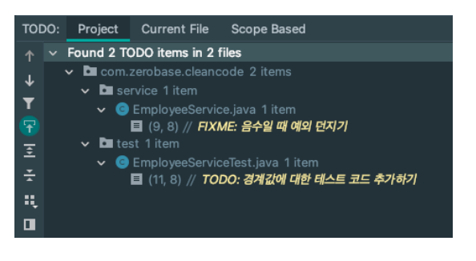

# 4.주석

1. 주석을 최대한 쓰지 말자 
    - 주석은 나쁜 코드를 보완 하지 못한다.
    - 코드에 주석을 추가하는 이유는 일반적인 이유는 코드의 품질이 나쁜 때문이다.
    - 자긴이 저지른 난장판을 주석으로 설명하지 말고 개선하는 데 시간을 보내야 한다.
    - 코드로 의도를 표현 할 수 있다
    - 좋은 코드로 주석을 대체 한다.
    
      
    
    ```jsx
    // 직원에게 복지 혜택을 받을 작격이 있는지 검사한다. 
    if ((employee.flags & HOURLY_FLAG) && emloyee.age > 65)
    
    // 의미있은 이름을 지으면 해결 된다. 
    if (emloyee.isEligibleForFullBenefits())
    ```
    
    - 주석은 방치 된다.
        
         코드는 컴파일 되기때문에 관리되지만 주석은 방치된다. 
        
        위 함수에서 복지 혜택에 연금 혜택 기준이 추가 된다면 
        
        위 쪽 코드에서  && 로 조건이 추가되고 주석에 수정을 하지 않으면 복지 혜택만 확인 하나보다 오해 할수 있다 
        
        아래 코드에서는 연금혜택의 의미를 담아서 함수 이름을 변경하면 된다. 
        
    

1. 좋은 주석 
    - 구현의 정보를 제공한다.
        
        아래 정규식은 보추어 설명한다. 
        
    
    ```jsx
    //kk:mm:ss EEE, MMM dd, yyyy 형식 
    Pettern timeFormat = Pattern.compile.("\\d*://d:\\ \\w*, \\w* \\d* \\d*")
    ```
    
    - 의도와 중요성을 설명 한다.
    
    ```jsx
    // 쓰레드를 많이 생성하여 시스템에 영향을 기쳐 테스트를 만들로록 함 
    for(int i = 0; i < 25000l i++){
    	SomeThread someThread = ThreadBuilder.builder().build();
    }
    
    //유저로 부터 입력 받은 값을 저장할 때 trim으로 공백 제거 필요 
    String userName = userNameInput.trim();
    // 
    ```
    
    - TODO : 앞으로 할 일 지금은 해결하지 않지만 나중에 해야할 일을 미리 적어 둘 때
    - FIXME : 문제가 있지만 당장 수정할 필요는 없을 때 가능하면 빨리 수정하는게 좋다.
    - IDE에서 하이라이팅되고, 별도의 윈도우에서 볼 수 있다.
    
    
    
2. 주석 보다 annotation
    - annotation = 코드에 대한 메타 데이터
    
    코드의실행흐름에간섭을주기도하고,주석처럼코드에대
    한정보를줄수있다.
    
    @Deprecated:컴파일러가warning을발생시킴.IDE에서사
    용시표시됨
    
    @NotThreadSafe:ThreadSafe하지않음을나타냄(책에서
    는주석으로표현했지만어노테이션을많이사용)
    
3.