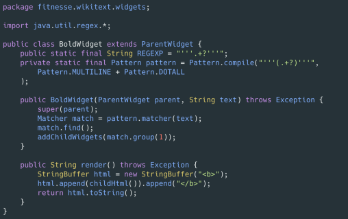

# 5. 형식 맞추기

## 1. 포멧팅이 중요한 이유

- 코드를 수월하게 읽어 나갈 수 있다
- 아마추어처럼 보이지 않난다.
- 포멧팅으로 인해 코드를 잘못 해석해 버그를 발생할 위험을 줄인다.

## 2.클린 코드 포맷팅

- 적절한 길이 유지
    - ~~200 라인 < 500
    - 코드 길이를 200 줄 정도는 제한하는 것은 반드시 지킬 엄격한 규칙은 아니지만, 일반 적으로 큰 파일이 작은 파일이 이해 하기 쉽다.
    - 코드 길이가 200 라인을 넘어 간다는 건 클래스가 여러가지 일을 하고 있을 수 있다. SRP 위배

## 3. 밀접한 개념은 가까이

- 행 묶은은 완결된 생각 하나를 표현하기 때문에 개념은 빈행으로분리하낟.
- 변수를 사용되는 위치에서 가까이 선언하다.

- Java Class Declarations
    1. static 변수 
        
        public → protected → package → private 순서
        
    2. instance 변수 
        
         public → protected → package → private 순서
        
    3. 생성자 
    4. 매서드 
        
        public 매서드에서 호출되는 private 메서드는 그 아래 둔다. 
        
        가독성 위주로 그룹핑한다. 
        

## 4. Team Coding Convention

개발 언의으 컨벤션이 우선이지만, 애매한 부분은 팀 컨벤션을 따른다. 

없다면, 함께 만들어 가는 것도 좋다. 

Mysql Convention

컬럼명는 snake_case로 네이밍한다. 

Team Convention

enum 타입으로 사용하는 varchar 타입의 경우 컬럼명은  _type으로 끝나도록 네이밍한다.