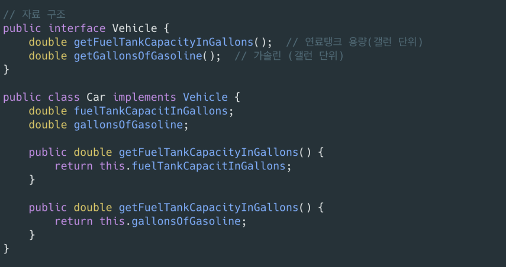

# 6. 객체와 자료구조로 데이터 표현하기

## 자료 구조 vs 객체

- 자료 구조 (Data Structure)
    - 데이터 그 가제
    - 자료를 공개 한다.
    - 변수 사이에 조회 함수와 설정 함수로 변수를 다른다고 객체가 되지 않는다.  (Getter, Setter)
- 객체 (Object)
    - 비지니스 로직와 관련
    - 자료구조를 숨기고 추상화 한다. 자료를 다르는 함수만 공개한다.
    - 추상한 인테페이스를 제공해 사용사가 구현을 모른채 자료의 핵심을 조작 할 수 있다.

예시1 ) 자료 구조 

- 단순히 연료 탱그 용량과 가솔린 양만 가져 온다

예시1) 객체 

     실제 탱크 용량과 가솔린 양이 아닌 남은 탱크 용량 페센테이지를 계산한여 반환한다. 

     탱크 용량이 0 일 수 없기 때문에 예외 처리가 들어가 있다. 

    

  핸드폰 배터리 처럼 실제 수치는 중요하지 않고 페센트만 중요하다면 실제 데이터를 바로 접근하는게 아니야  비지니스 로직에 맞쳐서 (사용자 관점에 맞쳐서)  구현하는게 적합하다

예시 2) 자료 구조 

절차적인 코드는 새로운 자료 구조를 추가하기 어렵고 함수를 고쳐야 한다. 

각각의 도형 클라스 Square, Rectangle, Circle 클라스가 존재하고 있고,

 Geometry 클라스에서 면적을 계산을 하는 area 만들었고, square 를 받아서 타입 체크를 한 후 각각의 클래스를 가져와서 Cast을 한 후 계산 한다. 

새로운 도형이 추가될때 마다 area  메소드가 else if 문이 추가 되어서 새로운 객체 타입 계산 식을 추가해야 한다. 

예시2) 객체 

Shape interface가 area라는 메소드를 가지고 있고 

Shape, Rectangle, Circle 클라스는 area 오버라이딩 하여 각각의 계산식을 만들어 낼 수 있다. 

단점은 함수를 각각 구현주어야 한다. 

- 자료구조를 사용하는 절차적인 코드는 기본 자료를 변경하지 않으면서 새 함수를  추가하기 쉽다.
- 절자적인 코드는 새로운 자료 구조른 추가하기 어렵다 그러려면 모든 함수를 고쳐햐한다.

- 객체지향 코드는 기종 함수를 변경하지 않으면서 개 클래스 추가하기 쉽다.
- 객체지향 코드는 새로운 함수를 추가하기 어렵다. 그러려면 모튼 클래수를 고쳐햐한다.

## 객체 디미터의 법칙

- 클래스 C의 메서드는 다음과 같은 객체의 메소드만 호출해야 한다.
    - 클래스 C
    - 자신이 생성한 객체
    - 자신의 인수로 넘어온 객체
    - C 인스턴스 변수에 저장된 객체

## 03.DTO(Data Transfer Object) = 자료 구조

- 다른 계층 간 데이터를 교환 할 때 사용
    - 로직 없이 필드만 갖는다.
    - 일반적으로 클래스명이 Dto(DTO)로 끝난다.
    - getter/ setter를 갖기도 한다.
- Beans
    
    Java Beans : 데이터 표현이 목적이  자바 객체 
    
    멤버 변수는 private 속성이다. 
    

## 04. Active Reord

- Database row를 객체에 맵핑하는 패턴  - 자료 구조
- 비즈니스 로스 메소드를 추가해 개체를 취급하는 건 바람직하지 않다.
- 비지니스 로직을 담으면서 내부 자료를 숨기는 객체는 따로 생성한다.
- Entity + Repository

