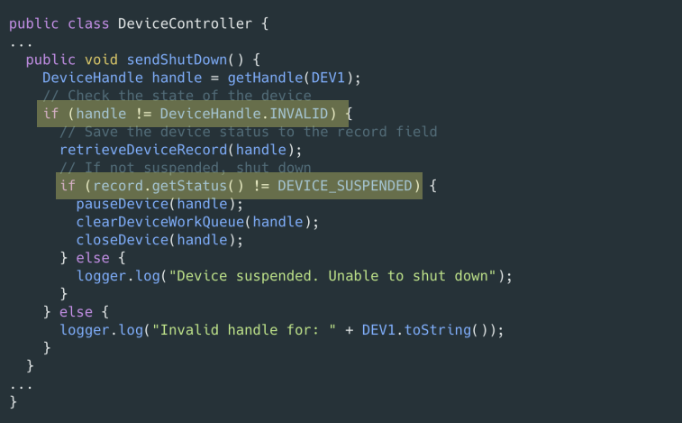

# 7. 오류 처리

## 01. 예외 처리 방식

1. 오류 코드를 리턴하지 말고, 예외를 던져라 
    - 옛날에는 오류를 나타낼 때 에러코드를 던졌다.
        - 매번 코드를 진행 할때 마다 그 상태들을 비교하면서 진행해야 되때문에 오류를 처리하는 코드가 복작하고 코드가 지저분하다.
    
    
    

1. 예외 처리
    
    1.오류가 발생한 부분에서 예외를 던진다.  (별도의 처리가 필요한 예외라면 Checked exception으로 던진다. 
    
    2.Checked exception에 대한 예외 처리를 하지 않는 다면 메소드 선언부에 throws를 명시해야 한다.
    
    3.예외를 처리할 수 있는 곳에서 catch 하여 처리한다. 
    
    
    

## 02. Unchecked Exception

1. Checked vs Unchecked Exception
    
    
    
    - Exception 상속하면 Checked Exception 명시적인 예외처리가 필요한다.
        - 예)  IOException, SqlExceptrion
        
        <EffectiveJava>Exception에관한규약
        
        > 자바언어명세가요구하는것은아니지만,업계에널리펴진규약으로
        Error클래스를상속해하위클래스를만드는일은자제하자.
        즉,사용자가직접구현하는unchekedthrowable은모두RuntimeException의하위클래스여야한다.
        Exception,RuntimeException,Error를상속하지않는throwable을만들수도있지만,이러한throwable은
        정상적인사항보다나을게하나도없으면서API사용자를헷갈리게할뿐이므로절대로사용하지말자
        > 
        - 특정 메소드에서 Check Exception 을 Throw 하고, 상위 메소드에서 그 Exception 을 chach 처리 한다면 모든 중간단계 메소드에서는 Exception을 Throws하는 처리가 필요하다.  (개방 폐쇄 원칙 위배 )
        
        > 안정적인소프트웨어를제작하는요소로확인된예외가반드시필요하지는않다는사실이분명해졌다
        C#은확인된예외를지원하지않는다.영웅적인시도에도불구하고C++역시
        확인된예외를지원하지않는다.파이썬이나루비도마찬가지다.
        그럼에도불구하고C#,C++,파이썬,루비는안정적인소프트웨어를구현하기에무리가없다.
        > 
        
    - Unchecked Exception
        - RuntimeException을 상속하면 Unchecked Exception 명시적인 예외 처리가 필요없다.
        
        예) NullPointerException,IllegalArgumentException,
        IndexOutOfBoundException
        

     

## 03. Exception 잘 쓰기

1. 예외에 메시지를 담아라
    - 예외에 의미 있는 정보 담기
        - -오류가 발생한 원인 위치를 찾기 쉽도록, 예외를 던질 때는 전후 상항을 충분히 덧붙인다.
        - 실패한 연산 이름 유현 든 정보를 담아 예외를 던진다.
    
    
    
2. Exception Wrapper 
    
    
    
    - 로그를 찍는 뿐 할 수 있는 일이 없다 .
    
    
    
    - port.open()시발생하는checkedexception들
    을감싸도록port를가지는LocalPort클래스를만
    든다.
    - port.open()이던지는checkedexception들을
    하나의PortDeviceFailureexception으로감싸서
    던진다.

## 04. 실무 예외 처리 패턴

1. 실무 예외 처리 패턴
    - getOrElse
        - 예외 대신 기본 값을 리턴한다.
            - null이 아닌 기본 값
            - 도메인에 맞는 기본 값
    - getorElseThrow
        - null 대신 예외를 던진다.
2. getOrElse - 예외 대신 기본 값을 리턴한다. 
    - null이 아닌 기본 값을 리턴한다.
        - 데이터가 없는 것을 null 표현하는 것 보단 size가 0인 컬렉션이 휠신 안전하다.
            - bad
                
                
                
            - Good
                
                
                
    - 도메인에 맞는 기본값을 가져온다.
        - bad
            
            
            
            호출부에서예외처리를통해userLevel값을처리한다.
            코드를계속읽어나가면서논리적인흐름이끊긴다.
            
        - Good
            
            
            
            
            
            예외처리를데이터를제공하는쪽에서처리해호출부코드가심플해진다.
            코드를읽어가며논리적인흐름이끊기지않는다.
            도메인에맞는기본값을도메인서비스에서관리한다.
            

## 05. 오픈소스 속 EXception 살펴 보기