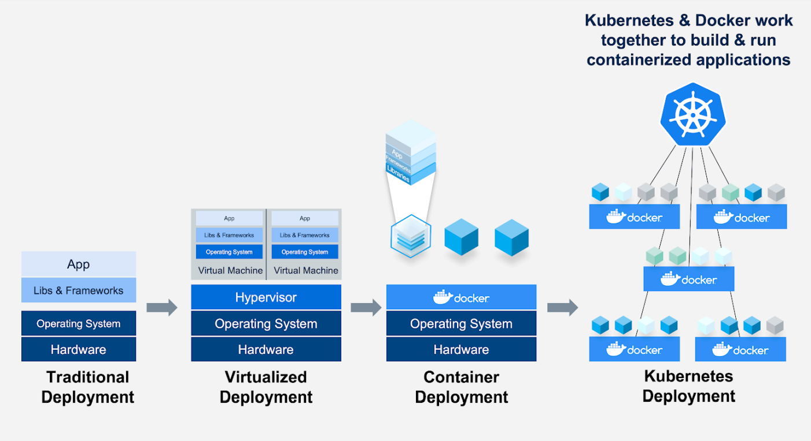

# Docker 기초

## 1. 컨테이너 기술의 발전



1. Traditional Deployment
    
    HW→ OS → Aplication 
    
    Aplication에 필요한 lib 나 Framework 를 운영체제에 설치 
    
    → 다양한 서비스 구동 시 각 서비스에 필요한 라이브러리 설치 시 의존성  충돌 문제 발생  
    
    각 서비스의 격리 필요 → 가상화 기술 발전
    
2. Vriualized Deployment
    
    HW→ OS → Hypervisor → guset os → app 
    
    Hypervisor 가 guset os 를 에뮬레이팅을 함 → 격리된 환경제공
    
    guset os는 각각 독립된  cpu, ram , hdd 자원을 가짐
    
    단점: 성능이 떨어짐 자원의 오버헤드 필요 
    
3. Containter Deployment
    
    HW→ OS → Docker 엔진 
    
    Docker → Containter 엔진 
    
    Docker 엔진 위에서 각 Containter 는 프로세서 형태로 실행 
    
    격리 기술 추가 (chroot, namespace)
    
    성능 효율성이 높고, 자원의 오버헤드 낮음, 의존성 중
    
4. Kubernetes Deployment 
    
    Containter Orchestration System 
    
    클러스터 환경에서  Containter 를 관리하는 기술
    

## 2. Docker 설치

1. Docker 설치  (우분트)

```yaml
#!/usr/bin/env bash
## INFO: https://docs.docker.com/engine/install/ubuntu/

set -euf -o pipefail

DOCKER_USER=ubuntu

# Install dependencies
sudo apt-get update && sudo apt-get install -y \
  apt-transport-https \
  ca-certificates \
  curl \
  gnupg \
  lsb-release

# Add Docker’s official GPG key
curl -fsSL https://download.docker.com/linux/ubuntu/gpg | sudo gpg --yes --dearmor -o /usr/share/keyrings/docker-archive-keyring.gpg

# Set up the stable repository
echo \
  "deb [arch=$(dpkg --print-architecture) signed-by=/usr/share/keyrings/docker-archive-keyring.gpg] https://download.docker.com/linux/ubuntu \
  $(lsb_release -cs) stable" | sudo tee /etc/apt/sources.list.d/docker.list > /dev/null

# Install Docker CE
sudo apt-get update && sudo apt-get install -y docker-ce docker-ce-cli containerd.io

# Use Docker without root
sudo usermod -aG docker $DOCKER_USER
```

1. Docker Compose 설치 

```yaml
#!/usr/bin/env bash
## INFO: https://docs.docker.com/compose/install/

set -euf -o pipefail

DOCKER_COMPOSE_VERSION=v2.1.1

# Download and install
sudo curl -L "https://github.com/docker/compose/releases/download/${DOCKER_COMPOSE_VERSION}/docker-compose-$(uname -s)-$(uname -m)" -o /usr/local/bin/docker-compose
sudo chmod +x /usr/local/bin/docker-compose
```

3. Docker 이미지와 컨테이너

1. Docker 구성 요서 


- client : Docker 명령어
- DOCKER_HOST : Docker 엔진  Image와 Container 관리
- Registry: 이미지 저장소

1. Image : 이미지는 컨테이너를 생성할 때 필요한 요소로컨테이너의 목적에 맞는 바이너리와 의존성이 설치되어 있음 여러 개의 계층으로 된 바이너리 파일로 존재
2. 컨테이너 (Container) : 호스트와 다른 컨테이너로부터 격리된 시스템 자원과 네트워크를 사용하는 프로세스 이미지는 읽기 전용으로 사용하여 변경사항은 컨테이너 계층에 저장
=> 컨테이너에서 무엇을 하든 이미지는 영향 받지 않음
3. 도커 이미지 이름 구성 
    - 저장소 이름/이미지이름:이미지 태그 (버전, 리비전)
    
    예) Registry/ngnix
    
    Registry/ngnix:1.2.1
    
    ngnix:lastest
    
    ngnix
    
    도커 이미지 Pull / Push 시에 저장소 이름은 생략하면 기본 저장소인 도커 허브로 인식
    도커 이미지 태그를 생략하면 최신 리비전을 가리키는 lastest로 인식
    
4. 도커 이미지 저장소 
    
    도커 이미지를 관리하고 공유하기 위한 서버 어플리케이션
    
    
    
    ## 4. 도커 컨테이너 라이프사이클
    
    
    
    도커 create / run 명령어 모두 이미지가 없을 경우 자동으로 pull을 먼저 수행하여 이미지를 다운로드 받음
    
    컨테이너 시작 주요 옵션
    
    ```bash
    docker run \                
    -i \                                # 호스트의 표준 입력을 컨테이너와 연결 (interactive)
    -t \                                # TTY 할당
    --rm \                              # 컨테이너 실행 종료 후 자동 삭제
    -d \                                # 백그라운드 모드로 실행 (detached)
    --name hello-world \                # 컨테이너 이름 지정
    -p 80:80 \                          # 호스트 - 컨테이너 간 포트 바인딩
    -v /opt/example:/example \          # 호스트 - 컨테이너 간 볼륨 바인딩
    fastcampus/hello-world:latest \     # 실행할 이미지
    my-command                          # 컨테이너 내에서 실행할 명령어
    ```
    
    1. 컨테이너 생성 
    
    ```bash
    docker create [image]
    ```
    
    1. 컨테이너 시작
    
    ```bash
    docker start [image]
    ```
    
    1. 컨테이너 생성및 시작 
    
    ```bash
    docker run [image]
    ```
    
     5. 컨테이너 실행하기 
    
    ```bash
    docker ps -a     #전체 컨테이너 목록 보기 
    docker ps        #실행 중인 도커 컨테이너 목록 보기
    docker run nginx #forgroung 모드로 nginx 컨테이너 실행 
    exit # 종료
    ```
    
    1. 컨테이너 생성 및 실행 
    
    ```bash
    docker create nginx
    c779197349084fb68799e061ec117291939884957b9a380e4112495f9faacdc5 # 컨테이너 아이디 
    docker ps -a     #전체 컨테이너 목록 보기 
    CONTAINER ID   IMAGE     COMMAND                  CREATED              STATUS    PORTS     NAMES
    c77919734908   nginx     "/docker-entrypoint.…"   About a minute ago   Created             inspiring_bhabha
    docker start inspiring_bhabha  #컨테이너 이름을 지정하여 컨테이너 실행
    ```
    
    1. 컨테이너 셀 실행 
        
        
        아래 명령어를 입력하여 컨테이너를 실행할 시 바로 종료가 된다. 
        
        
        
        ubuntu 이미지가 bash 이라는 표준 입출력이 필요한 명령어로 실행 되었기 때문이다. 
        
        
        
        -i -t 옵션을 추가한 후 실행해야한다. 
        
        
        
        ctrl +p +q 를 누르면 컨테이를 종료하지 않은 상태에서 빠져나올수 있다. 
        
        백그라운드로 컨테이너 실행하기 
        
    
         아래 명령이를 입력하면 nginx 가 forground 로 실행한다. 
    
    ```bash
    docker run nginx 
    ```
    
    
    
    -d 옵션을 추가한 후 컨테이너를 실행하면 background로 실행한다. 
    
    
    
    
    
    1. 컨테이너 이름 지정하기 (—name)
        
        
        
    2. Port binding (-p)
    
    nginx 컨테이너 80번 포트와 로컬 80 번 포트 연결 
    
    
    
    1. 명령어 실행 
    
    우분트 id 명령어 실행 
    
    
    
    1. 컨테이너 실행 후 바로 삭제 
        
        ```bash
        docker run --rm  ubuntu:focal id
        ```
        
    2. 컨테이너 상세 정보 
    
         
    
    ```bash
    docker inspect a0c8
    
    [
        {
            "Id": "a0c834b7d5db4ed00dbd735ac6e655293c2f3924f1080ba27053529748fea40e",
            "Created": "2022-09-03T10:39:17.857308766Z",
    .......
    ```
    
    1. 실행 중인 컨테이너 상태 확인 
    
    ```bash
    docker pa
    ```
    
    1. 전체 컨네이너 상태확인 
    
    ```bash
    docker pa -a
    ```
    
    16 컨테이너 일시 중지 / 재개
    
    ```bash
    docker pause
    docker unpause
    
    ```
    
    1. 컨테이너 종료 / 컨테이너 강제 종료 
    
    ```bash
    docker stop [container]
    docker kill [container]
    docker stop $(docker ps -a -q) # 모든 컨테이너 종료 
    ```
    
    1. 컨테이너 삭제  
    
    ```bash
    docker rm [container] # 컨테이너 삭제 (실행중인 컨테이너 불가)
    docker rm -f [container] # 컨테이너 강제 종료 후 삭제 (SIGKILL 시그널 전달)
    docker run --rm # 컨테이너 실행 종료 후 자동 삭제
    docker container prune # 중지된 모든 컨테이너 삭제
    ```
    
     
    
      
    

## 5. 엔트리포인트와 커맨드

엔트리포인트 (Entrypoint)

도커 컨테이너가 실행할 때 고정적으로 실행되는 스크립트 혹은 명령어
생략할 수 있으며, 생략될 경우 커맨드에 지정된 명령어로 수행

커맨드 (Command)

도커 컨테이너가 실행할 때 수행할 명령어 혹은 엔트리포인트에 지정된 명령어에 대한 인자 값

실제 수행되는 컨테이너 명령어

[Entrypoint] [Command]

- dockerfile

[docker-entrypoint.sh](http://docker-entrypoint.sh) node 이라는 명령어 실행 

```bash
FROM node:12-alpine
RUN apk add --no-cache python3 g++ make
WORKDIR /app
COPY . .
RUN yarn install --production
ENTRYPOINT ["docker-entrypoint.sh"]  # 컨테이너 시작 시 실행할 스크립트 파일명
CMD ["node"] # 스크립트 파일 인자
```

- 도커 명령어에는 지정된 entrypoint와 command를 오버라이딩 할 수 있다

```bash
$ docker run --entrypoint sh ubuntu:focal  #우분트 실행 시 기본 bash 대신 sh 셀 실행 
$ docker run --entrypoint echo ubuntu:focal hello world # echo 로 변경
```

## 6. 환경변수

-e 

```bash
docker run -i -t -e [환경 변수명]=[환경 변수 값] ubuntu:focal bash
```


- -env-file

```bash
docker run -i -t --env-file [환경 변수명]=[환경 변수 값] ubuntu:focal bash
```


환경 변수는 사용하는 이미지의 공식 홈페이지에가서 확인 할 수 있다. 

[https://hub.docker.com/_/nginx](https://hub.docker.com/_/nginx)


## 7. **명령어 실행**

docker exec

실행중인 컨테이너에 명령어를 실행합니다

```bash
$ docker exec [container] [command]
# my-nginx 컨테이너에 Bash 셸로 접속하기
$ docker exec -i -t my-nginx bash
# my-nginx 컨테이너에 환경변수 확인하기
$ docker exec my-nginx env
```

my-nginx 컨테이너 환경 변수 출력 


## 8. 네트워크


eth0 : host 기본 네트워크 (ec2 private ip)

veth: virtual eth

docker0: 도커 엔진에 의해 기본 생성되는 브릿지 네트워크

veth: veth와 컨테이너 내의  eth 간 다리 역할

- 컨테이너의 포트를 호스트의 IP:PORT와 연결하여 서비스를 노출합니다.

```bash
$ docker run -p [HOST IP:PORT]:[CONTAINER PORT] [container]
# nginx 컨테이너의 80번 포트를 호스트 모든 IP의 80번 포트와 연결하여 실행
$ docker run -d -p 80:80 nginx
# nginx 컨테이너의 80번 포트를 호스트 127.0.0.1 IP의 80번 포트와 연결하여 실행
$ docker run -d -p 127.0.0.1:80:80 nginx
# nginx 컨테이너의 80번 포트를 호스트의 사용 가능한 포트와 연결하여 실행
$ docker run -d -p 80 nginx
```

-Expose vs Publish

```bash
# expose 옵션은 그저 문서화 용도
$ docker run -d --expose 80 nginx
# publish 옵션은 실제 포트를 바인딩
$ docker run -d -p 80 nginx
```

expose 옵션을 사용 할 경우 실제 포트가 바인딩 되지 않는다 

별다른 기능은 없고 문서화하는 기능만 가지고 있다. 


도커 네트워크 드라이버

 

```bash
syhan@ubuntu:~/Desktop$ docker network ls  #도커 네트워크 목록 확인
NETWORK ID     NAME                               DRIVER    SCOPE 
69ab60c04d2e   bridge                             bridge    local 
ddff4ae09582   host                               host      local
b6df3ff93014   none                               null      local
```

 


Native Drivers 

- Bridge
- host
- none

Remote Drivers : 3th party 플러그인을 설치한는 방싱으로

1. none network 로 실행 
- 인터넷 기능을 사용하지 않을 때 사용

```bash
docker run -i -t --net none ubuntu:focal
```

ispect 명령어로 ip address 정보 확인 시  ip address가 없다 


1. host network 
- 포트바이딩을 사용하지 않고 호스트 네트워크에 붙여서 사용

```bash
docker run -d --network=host grafana/grafana
```

포드 목록은 보이지 않으며 3000번 포트로 접속 가능


1. bridge network 
    
    기본 docker0 사용하거나 사용자 정의 네트워크 생성 할 수 있다 
    

```bash
#!/usr/bin/env sh

docker network create --driver=bridge netoworkname 

docker run -d --network=netoworkname --net-alias=hello nginx    
docker run -d --network=netoworkname --net-alias=grafana grafana/grafana
```

create --driver=bridge [netowork name ] : 사용자 정의 네트워크 생성 

--net-alias [host name ] = 안에서 도메인 네임으로 컨테이너 IP 를 서치 할 수 있다. 

```sql

```

grafana 컨테이너에서 hello라는 도메인명으로 nginx 접속하였다.  


공식 문서 

[Networking overview](https://docs.docker.com/network/)

## 9. 볼륨

1. 도커 레이어 아키텍쳐 


1. 호스트 볼륨
    
    호스트의 디렉토리를 컨테이너의 특정 경로에 마운트합니다
    
    ```bash
    # 호스트의 /opt/html 디렉토리를 Nginx의 웹 루트 디렉토리로 마운트
    $ docker run -d \
    --name nginx \
    -v /opt/html:/usr/share/nginx/html \
    nginx
    ```
    
2. 볼륨 컨테이너

특정 컨테이너의 볼륨 마운트를 공유할 수 있습니다.


```bash
docker run -d \
--name my-volume \
-it \
-v /opt/html:/usr/share/nginx/
html \
ubuntu:focal

# my-volume 컨테이너의 볼륨을 공유
$ docker run -d \
--name nginx \
--volumes-from my-volume \
nginx
```

1. 도커 볼륨

도커가 제공하는 볼륨 관리 기능을 활용하여 데이터를 보존합니다.
기본적으로 /var/lib/docker/volumes/${volume-name}/_data 에 데이터가 저장됩니다.

```bash
# web-volume 도커 볼륨 생성
$ docker volume create --name db

# 도커의 web-volume 볼륨을 Nginx의 웹 루트 디렉토리로 마운트
$ docker run -d \
--name fastcampus-mysql \
-v db:/var/lib/mysql \  
-p 3306:3306 \
mysql:5.7
```

1. 읽기 전용 볼륨 

볼륨 연결 설정에 :ro 옵션을 통해 읽기 전용 마운트 옵션을 설정할 수 있습니다.

```bash
# 도커의 web-volume 볼륨을 Nginx의 웹 루트 디렉토리로 읽기 전용 마운트
$ docker run -d \
--name nginx \
-v web-volume:/usr/share/nginx/html:ro \
nginx
```

## 10. 로그

도커 컨테이너에서 로그를 다르기 위해서는 어플리케이션에서 STDOUT / STDERR 으로 로그를 내보내야한다.  

그렇게 쌓아진 로그를 logging driver에서 처리한다. 


1. 로그 확인 

```bash
# 전체 로그 확인
$ docker logs [container]
# 마지막 로그 10줄 확인
$ docker logs --tail 10 [container]
# 실시간 로그 스트림 확인
$ docker logs -f [container]
# 로그마다 타임스탬프 표시
$ docker logs -f -t [container]
```

1. 호스트 운영체제의 로그 저장 경로

```bash
$ cat /var/lib/docker/containers/${CONTAINER_ID}/${CONTAINER_ID}-json.log
```


1. 로그 용량 제한하기

컨테이너 단위로 로그 용량 제한을 할 수 있지만, 도커 엔진에서 기본 설정을 진행할 수도 있습니다. (운영환경에서 필수 설정)

```bash
# 한 로그 파일 당 최대 크기를 3Mb로 제한하고, 최대 로그 파일 3개로 로테이팅.
$ docker run \
-d \
--log-driver=json-file \
--log-opt max-size=3m \
--log-opt max-file=5 \
nginx
```

1. 도커 로그 드라이버
    
    
    json file log → 로그 에이전트(LogStash****,**** Filebeat, fluentd) → 중앙화된 로그 시스템 (elastic )
    
    
    
    ## 11. 이미지 빌드
    
    1. 도커 이미지 구조
    - Docker Image
    
    도커 이미지는 기본적으로 Layer 구조로 새로운 변경이 위쪽에 쌓인다. 
    
    ubuntu는 Layer A, B, C 구조로 되어 있고 
    
    nginx는 ubuntu 이미지 기반으로 만들어 졌기 때문에 
    
    ubuntu의  Layer A, B, C 위에 nginx 레이어가 쌓인다. 
    
    web app 은 nginx  이미지 기반으로 만들어 졌기 때문에 
    
    ubuntu 의  Layer A, B, C , nginx 레이어 위에 web app source 레이어가 쌓인다. 
    
    - Docker Container
    
    web app image layer Read only 생성 
    
    container Layer R/W 가능 (Container 삭제 시 같이 삭제)
    
    
    
    1. 도커 이미지 Layer 확인 
    
     
    
    ```bash
    docker images    # docker image 목록 조회 
    ubuntu                          focal     a0ce5a295b63   2 days ago      72.8MB
    grafana/grafana                 latest    e8b7539c51bf   4 days ago      299MB
    nginx                           latest    2b7d6430f78d   12 days ago     142MB
    localstack/localstack           latest    960bc03bdce2   2 weeks ago     1.44GB
    mysql/mysql-server              5.7       5cd20562c12e   5 weeks ago     412MB
    mysql                           5.7       3147495b3a5c   5 weeks ago     431MB
    wordpress                       5.8.1     ccd598bc2c91   10 months ago   616MB
    hello-world                     latest    feb5d9fea6a5   11 months ago   13.3kB
    confluentinc/cp-kafka-connect   6.2.0     f2a7a2dc5d6d   12 months ago   1.29GB
    confluentinc/cp-kafka           6.2.0     6b8633010002   12 months ago   772MB
    confluentinc/cp-zookeeper       6.2.0     3cf98185738a   12 months ago   772MB
    
    docker image inspect nginx # nginx image 상세 조회 
    
    ~~~~~~~~~~~~~
    "RootFS": {
                "Type": "layers",
                "Layers": [   # layer 정보 
                    "sha256:6485bed636274e42b47028c43ad5f9c036dd7cf2b40194bd556ddad2a98eea63",
                    "sha256:22611703157342d0e3a1ae8890b7b564d1e79eddd0c80fc66ede3d4e5d59af31",
                    "sha256:04ab349b7b3bf555d5f54232ed6c5c1400ac7b7180a62223907f3037199a8c04",
                    "sha256:7b9055fc8058c89faade24ae11c1871fc164ddf9f06579b067f019dc566c45e2",
                    "sha256:2c31eef17db8da4db48dd66e8731989472e6250c10bf1cf40bb2d37d6b109168",
                    "sha256:73993eeb8aa2c912c71b6f2ccb6b1848a45489dac7c9980a5cdfd109af5e8d95"
                ]
            },
            "Metadata": {
                "LastTagTime": "0001-01-01T00:00:00Z"
            }
        }
    ]
    ```
    
    1. Dockerfile 없이 이미지 생성
    
    기존 컨테이너를 기반으로 새 이미지를 생성할 수 있습니다.
    
    ```bash
    # docker commit [OPTIONS] CONTAINER [REPOSITORY[:TAG]]
    # ubuntu 컨테이너의 현재 상태를 my_ubuntu:v1 이미지로 생성
    $ docker commit -a "author" -m “Commit message” ubuntu my_ubuntu:v1
    ```
    
    우분트 컨테이너를 실행 후 my_file을 생성 후 shell에서 빠져 나온다. 
    
    
    
    commit 명령어를 이용 하여 컨테이너을 이미지로 저장한다. 
    
    
    
    image inspect 명령어로 layer정보를 확인해본 결과 기본이 되는 ubuntu 이미지 보다 layer가 추된것을 확인 할 수 있다. 
    
    - my_unbuntu:v1 layer 정보
    
    
    
    - ubuntu 이미지  layer 정보
    
    
    
    1. Dockerfile 이용하여 이미지 생성
    
    Dockerfile을 기반으로 새 이미지를 생성할 수 있습니다.
    
    Dockerfile 예시 
    
    ```bash
    FROM node:12-alpine
    RUN apk add --no-cache python3 g++ make
    WORKDIR /app
    COPY . .
    RUN yarn install --production
    CMD ["node", "src/index.js"]
    ```
    
    Dockerfile을 기반으로 새 이미지를 생성
    
    ```bash
    # docker build [OPTIONS] PATH
    # ./ 디렉토리를 빌드 컨텍스트로 my_app:v1 이미지 빌드 (Dockerfile 이용)
    $ docker build -t my_app:v1 ./
    # ./ 디렉토리를 빌드 컨텍스트로 my_app:v1 이미지 빌드 (example/MyDockerfile 이용)
    $ docker build -t my_app:v1 -f example/MyDockerfile ./
    ```
    
    빌드 컨텍스트
    
    도커 빌드 명령 수행 시 현재 디렉토리(Current Working Directory)를 빌드 컨텍스트(Build Context)라고 합니다.
    Dockerfile로부터 이미지 빌드에 필요한 정보를 도커 데몬에게 전달하기 위한 목적입니다
    
    .dockerignore
    
    .gitignore와 동일한 문법을 가지고 있습니다.
    특정 디렉토리 혹은 파일 목록을 빌드 컨텍스트에서 제외하기 위한 목적입니다.
    
    ## 12. Dockerfile 문법
    
    1. Format 
    
    ```bash
    # Comment
    INSTRUCTION arguments 
    ```
    
    #Comment : 주석
    
    INSTRUCTION : 지시어
    
    arguments  : 인자 
    
    ```bash
    # Comment
    RUN echo 'we are running some # of cool things'
    ```
    
    RUN : 지시어
    
    echo 'we are running some # of cool things' : 인자 
    
    1. Environment replacement
    
    ```bash
    FROM busybox
    ENV FOO=/bar     # Foo 라는 환경 변수에 /bar라는 환경 변수값 추가 
                     
    WORKDIR ${FOO}   # WORKDIR /bar
    ADD . $FOO       # ADD . /bar
    COPY \$FOO /quux # COPY $FOO /quux
    ```
    
    ENV FOO=/bar : 컨테이너 환경 변수 Foo 라는 환경 변수에 /bar라는 환경 변수값 추가 
    
    3. ARG 
    
    인자 선언 
    
    ```bash
    FROM busybox
    ARG user1
    ARG buildno
    ```
    
    인자에 기본값 설정 
    
    ```bash
    FROM busybox
    ARG user1=someuser #기본값 지정 
    ARG buildno=1
    # ...
    ```
    
    Dockerfile 빌드 시 실행 인자 전달 
    
    ```bash
    docker build --build-arg user=what_user .
    ```
    
    Scope : 아래와 같이 선언 시 인자값 보다 우선 
    
    ```bash
    FROM busybox
    USER ${user:-some_user}
    ARG user
    USER $user
    # ...
    ```
    
    환경 변수와 같이 사용시 : 환경 변수 사용
    
    ```bash
    FROM ubuntu
    ARG CONT_IMG_VER
    ENV CONT_IMG_VER=v1.0.0 
    RUN echo $CONT_IMG_VER
    ```
    
     `docker build --build-arg CONT_IMG_VER=v2.0.1 .`
    
    CONT_IMG_VER 값은 v1.0.0 
    
    ```bash
    #  주석
    # nodejs-server
    #
    # build:
    #   docker build --force-rm -t nodejs-server .
    # run:
    #   docker run --rm -it --name nodejs-server nodejs-server
    #
    
    FROM node:16   # base image
    LABEL maintainer="FastCampus Park <fastcampus@fastcampus.com>"  # image meta data (optional)
    LABEL description="Simple server with Node.js"
    
    # Create app directory
    WORKDIR /app  # set working directory (리눅스 cd 명령어)
    
    # Install app dependencies
    # A wildcard is used to ensure both package.json AND package-lock.json are copied
    # where available (npm@5+)
    COPY package*.json ./  # (cpoy file src to dest) 
    											 # working dir + dest 
    											 # /app
    
    RUN npm install        # exec command 
    # If you are building your code for production
    # RUN npm ci --only=production
    
    # Bundle app source
    COPY . .
    
    EXPOSE 8080            # port number 문서화 목적
    CMD [ "node", "server.js" ]  # 해당 이미지를 가지고 컨테이너를 실행 할 때 실행할 명령어 
    ```
    
    ## 13. 이미지 압축파일로 저장 / 불러오기
    
    이미지를 tar 압축파일로 저장합니다.
    
    ```bash
    # docker save -o [OUTPUT-FILE] IMAGE
    # ubuntu:focal 이미지를 ubuntu_focal.tar 압축 파일로 저장
    $ docker save -o ubuntu_focal.tar ubuntu:focal
    ```
    
    이미지를 tar 압축파일로부터 불러옵니다.
    
    ```bash
    # docker load -i [INPUT-FILE]
    # ubuntu_focal.tar 압축 파일에서 ubuntu:focal 이미지 불러오기
    $ docker load -i ubuntu_focal.tar
    ```
    
    ## 14. 도커 허브에 도커 업로드 하기
    
    1. 도커 허브 회원 가입 
    2. 시크릿키 발급 → accountint setting → Secuity → Access Tokens 
    3. 로그인 하기 : docker login -u aksla1122 
    
    password에 앞단계에서 발급 받은 시크릿 키 입력 
    
    1. image tagging  :  docker tag nginx aksla1122/my-nginx:v1.0.0
    2. image push :  docker push aksla1122/my-nginx:v1.0.0
    
    ## 15. 도커 이미지 경량화 전략
    
    1. 꼭 필요한 패키지 및 파일만 추가 
    2. 컨테이너 레이어 수 줄이기→ RUN 명령어가 하나의 레이어가 된다. 
    3. 경량 베이스 이미지 선택 → debian slim, alpine, stretch
    4. 멀티 스테이지 빌드 사용
    
    - && 문법으로 3가지 명령어를 하나의 RUN 에서 실행 한다. 
    cache를 남겨 두지 않기 위해 --no-cache 옵션을 지원하는 고려한다. 
    불필요한 패키지를 삭제 한다.
    
    ```bash
    #
    # slacktee
    #
    # build:
    #   docker build --force-rm -t slacktee .
    # run:
    #   docker run --rm -it --name slacktee slacktee
    #
    
    FROM alpine:3.14
    LABEL maintainer="FastCampus Park <fastcampus@fastcampus.com>"
    LABEL description="Simple utility to send slack message easily."
    
    # Install needed packages 
    
    RUN \
      apk add --no-cache bash curl git && \
      git clone https://github.com/course-hero/slacktee /slacktee && \
      apk del --no-cache git    
    RUN chmod 755 /slacktee/slacktee.sh
    
    # Run
    WORKDIR /slacktee
    ENTRYPOINT ["/bin/bash", "-c", "./slacktee.sh"]
    ```
    
    기본 node 사용 시 905mb, 16-slim 이미지 일 경우 174mb , alpine 이미지일 경우 110 mb를 차지한다.  여러 기본 이미지중 최대한 경량환된 이미지를 사용한다. 
    
    
    
    ## 16. Docker 데몬 로그
    
    ```bash
    docker system events # 우분트 도커 데몬 로그
    
     
    journalctl -u docker # 우분트 도커 데몬 로그
    
    docker system df # docker 의 disk 사용량 
    docker system df -v # # docker 의 상세  disk 정보
    docker system prune # 사용하지 않는 컨테이너 이미지, 캐시 삭제 
    
    docker stats # 각 컨테이너별 cpu, 메모리 사용량 
    ```