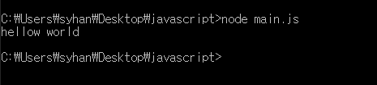

# 1.자바스크립트 실행하기

1.자바스크립트 실행하기

main.js 파일을 작성 한다

```jsx
console.log("hellow world");
```

 1. node.js로 하기 



1. html 파일에 삽입하기
    
    
    

       3. 브라우저 개발자 모드 콘솔에서도 자바 스크립트를 실행 할 수 있다 

      


1. script async 와 defer의 차이점
    1. head에서 script 태그가 있을 시 
    
    html 파일을 파싱하다가 스트립트 태그를 만나면 파싱을 멈추고 js 파일을 다운 및 실행을 한 후 다시 html 파싱을 한다. 
    
    js 파일이 사이즈가 클 경우 사용자가 웹사이트 보는데 시간이 많이 걸린다. 
    
    ```jsx
    <!DOCTYPE html>
    <html lang="en">
    <head>
        <meta charset="UTF-8">
        <meta http-equiv="X-UA-Compatible" content="IE=edge">
        <meta name="viewport" content="width=device-width, initial-scale=1.0">
        <title>Document</title>
        <script src="main.js"></script>
    </head>
    <body>
    </body>
    </html>
    ```
    
    
    
    b. body 태그 맨 밑에 있을 때 
    
    사용자가 기본적인 content를 빨리 보지만 사용자가 의미 있는 사이트를 보는 데는 시간이 오래 걸린다. 
    
    ```jsx
    <!DOCTYPE html>
    <html lang="en">
    <head>
        <meta charset="UTF-8">
        <meta http-equiv="X-UA-Compatible" content="IE=edge">
        <meta name="viewport" content="width=device-width, initial-scale=1.0">
        <title>Document</title>
    </head>
    <body>
        <script src="main.js"></script>
    </body>
    </html>
    ```
    
    
    
    c. async 
    
    병렬로 js 를 다운로드 받고 완료 후 실행을 안다. 
    
    다운로드 시간을 절약 할 수 있으나 js에서 dom 요소를 조작 하는 경우 조작 시 아직 정의 되어 있지 않을 수 있다 
    
    js를 실행 하는 경우 html 파싱을 멈추기 때문에 사용자가 페이지를 보는데 여전히 오래 걸린다. 
    
    ```jsx
    <!DOCTYPE html>
    <html lang="en">
    <head>
        <meta charset="UTF-8">
        <meta http-equiv="X-UA-Compatible" content="IE=edge">
        <meta name="viewport" content="width=device-width, initial-scale=1.0">
        <title>Document</title>
        <script async src="main.js"></script>
    </head>
    <body>
    </body>
    </html>
    ```
    
    
    
    정의된 순서와 상관 없이 다운로드 받은 순서로 실행되기 때문에 순서의 의존 적인 스크립트에서는 상용하면 안된다. 
    
    ```jsx
    <!DOCTYPE html>
    <html lang="en">
    <head>
        <meta charset="UTF-8">
        <meta http-equiv="X-UA-Compatible" content="IE=edge">
        <meta name="viewport" content="width=device-width, initial-scale=1.0">
        <title>Document</title>
        <script async src="a.js"></script>
        <script async src="b.js"></script>
        <script async src="c.js"></script>
    </head>
    <body>
    </body>
    </html>
    ```
    
    
    
    d.defer
    
    html 파싱을 하다가 스트립트을 만나면 다운로드만 받고 html 파싱이 끝나면 js 을 실행 한다. 
    
    ```jsx
    <!DOCTYPE html>
    <html lang="en">
    <head>
        <meta charset="UTF-8">
        <meta http-equiv="X-UA-Compatible" content="IE=edge">
        <meta name="viewport" content="width=device-width, initial-scale=1.0">
        <title>Document</title>
        <script defersrc="main.js"></script>
    </head>
    <body>
    </body>
    </html>
    ```
    
    
    
    파싱하는 동안 js 파일을 다 다운로드 받고 정의된 순서되로 실행한다. 
    
    ```jsx
    <!DOCTYPE html>
    <html lang="en">
    <head>
        <meta charset="UTF-8">
        <meta http-equiv="X-UA-Compatible" content="IE=edge">
        <meta name="viewport" content="width=device-width, initial-scale=1.0">
        <title>Document</title>
        <script async src="a.js"></script>
        <script async src="b.js"></script>
        <script async src="c.js"></script>
    </head>
    <body>
    </body>
    </html>
    ```
    
    
    
    1. use strict 
        
        선언되지 않는 변수는 쓸 수가 없다 . 짱짱짱
        
        added ECMAScript 
        
        ```jsx
        'use strict'
        a = 6;
        ```
        
        