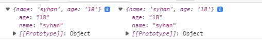

# es6 추가 문법

1. Shorthand property names
    
    key와 value 의 이름이 동일 한 경우 하나로 축약해서 쓸수 있다 
    
    [https://developer.mozilla.org/ko/docs/Web/JavaScript/Reference/Operators/Object_initializer](https://developer.mozilla.org/ko/docs/Web/JavaScript/Reference/Operators/Object_initializer)
    

```jsx
	const name = 'syhan';
	const age = '18';
	
	const user1 = {
	    name : name,
	    age : age
	}
	
	// key와 value 의 이름이 동일 한 경우 하나로 축약해서 쓸수 있다 
	const user2 = {
	    name,
	    age
	}
	
	console.log(user1, user2);
```



1. Destructuring Assignment (비구조 할당 )
    
    객체 안에 있는 값을 추출해서 변수 혹은 상수로 바로 선언해 줄 수있었다
    
    [https://developer.mozilla.org/ko/docs/Web/JavaScript/Reference/Operators/Destructuring_assignment](https://developer.mozilla.org/ko/docs/Web/JavaScript/Reference/Operators/Destructuring_assignment)
    

```jsx
const student = {
	name: '승연',
	level: 1
}

	const name = student.name;
	const level = student.level;
	console.log(name, age);

//student의 key와 value가 name, level 할당 된다. 
const {name, level} = student;
console.log(name, level);

// 다른이름으로 선언 하고 싶을 시 
const {name: studentName, level: studentLevel} = student;
console.log(studentName, studentLevel);
 
```


 

배열에서 사용 하고 싶을 때 

```jsx
const animals = ['강아지' , '고양이'];
const first = animals[0];
const second = animals[1];
console.log(first, second);

const animals = ['강아지', '고양이'];
const [first, second] = animals;
console.log(first, second);
     
```


1. Spread Syntax
    
    spread 라는 단어가 가지고 있는 의미는 펼치다, 퍼뜨리다 입니다. 이 문법을 사용하면, 객체 혹은 배열을 펼칠수있습니다.
    
    [https://developer.mozilla.org/ko/docs/Web/JavaScript/Reference/Operators/Spread_syntax](https://developer.mozilla.org/ko/docs/Web/JavaScript/Reference/Operators/Spread_syntax)
    
    ```jsx
    const obj1 = {key: 'key1'};
    const obj2 = {key: 'key2'};
    const array = [obj1, obj2];
    
    // array copy
    const arrayCopy = [...array];
    console.log(arrayCopy);
    ```
    
    
    

      값을 추가 할 때

```jsx
const arrayCopy2 = [...array, {key: 'key3'}];
```


obj에서 사용 할때 

```jsx
// obj 복사 할때 
const obj3 = {...obj1};
```

object merg

```jsx
//object merg
키가 동일한 obj를 병합한다면 뒤에 있는 obj가 값을 덮혀 쓴다
const dog1 = {dog1 : "강아지"};
const dog2 = {dog2 : "강아지"};
const dog = {...dog1, ...dog2};

```

배열 연결

```jsx
// array connactenation 
const fruits1 = ['자두', '딸기'];
const fruits2 = ['바나나', '키위'];

// 아래 코드와 동일한 코드이다. 
const fruits = [...fruits1, ...fruits2];
const fruits1 = ['자두', '딸기'];
const fruits2 = ['바나나', '키위'];
const fruits3 =  fruits1.concat(fruits2);
console.log(fruits3);
```

```jsx
const item = { type: '👔', size: 'M' };
const detail = { price: 20, made: 'Korea', gender: 'M' };

// ❌ Bad Code 💩
  item['price'] = detail.price;

  // ❌ Bad Code 💩
  const newObject = new Object();
  newObject['type'] = item.type;
  newObject['size'] = item.size;
  newObject['price'] = detail.price;
  newObject['made'] = detail.made;
  newObject['gender'] = detail.gender;
  console.log(newObject);

  // ❌ Bad Code 💩
  const newObject2 = {
	  type: item.type,
	  size: item.size,
	  price: detail.price,
	  made: detail.made,
	  gender: detail.gender,
  };
  console.log(newObject);

// ✅ Good Code ✨
const shirt0 = Object.assign(item, detail);
console.log(shirt0);

// ✅ Better! Code ✨
const shirt = { ...item, ...detail, price: 30 };
console.log(shirt);

let fruits = ['🍉', '🍊', '🍌'];

// fruits.push('🍓');
fruits = [...fruits, '🍓'];
console.log(fruits);

// fruits.unshift('🍇');
fruits = ['🍇', ...fruits];
console.log(fruits);

const fruits2 = ['🍈', '🍑', '🍍'];

let combined = fruits.concat(fruits2);
combined = [...fruits, '🍒', ...fruits2];
console.log(combined);

```

1. Default parameters
    
    [https://developer.mozilla.org/ko/docs/Web/JavaScript/Reference/Functions/Default_parameters](https://developer.mozilla.org/ko/docs/Web/JavaScript/Reference/Functions/Default_parameters)
    
    ```jsx
    function printMessage(message){
      if(message == ''){
          message = 'default message';
      }
    
      console.log(message)
    }
    
    printMessage('hello'); 
    printMessage();
    
    //인자가 전달되었을 경우 인자 값없을 경우 기본값
    function printMessage(message = 'message'){
        console.log(message)
    }
    
    printMessage('hello'); //hello 출력
    printMessage(); //undefined 출력
    ```
    
2. Ternary Operator
    
    [https://developer.mozilla.org/ko/docs/Web/JavaScript/Reference/Operators/Conditional_Operator](https://developer.mozilla.org/ko/docs/Web/JavaScript/Reference/Operators/Conditional_Operator)
    
    ```jsx
    const isCat = true;
    {
        let component;
        if(isCat) {
            component = "고양이";
        } else {
            component = "강아지";
        }
    }
    
    const isCat = true;
    const component = isCat ? '고양이' : '강아지';
    console.log(isCat ? '고양이' : '강아지');
    ```
    
3. Template Literals
    
    [https://developer.mozilla.org/ko/docs/Web/JavaScript/Reference/Template_literals](https://developer.mozilla.org/ko/docs/Web/JavaScript/Reference/Template_literals)
    
    조건 ? true일때 : false일때
    
    ```jsx
    const weather = '흐림';
    const temparature = '15C';
    
    console.log('Today weather is ' + weather + 'and temparature is' + temparature);
    console.log(`Today weather is ${weather} and and temparature is ${temparature}`);
    ```
    
4. && 연산자로 코드 단축시키기
    
    A && B 연산자를 사용하게 될 때에는 A 가 Truthy 한 값이라면, B 가 결과값이 됩니다. 반면, A 가 Falsy 한 값이라면 결과는 A 가 됩니다.
    
    ```jsx
    //&& 
    const dog = {
      name: '멍멍이'
    };
    
    function getName(animal) {
    	if (animal) {
    		return animal.name;
    	}
    	return undefined;
    }
      
      const name = getName();
      console.log(name);
    
    const dog = {
        name: '멍멍이'
      };
      
      function getName(animal) {
        return animal && animal.name;
      }
      
      const name = getName();
      console.log(name); // undefined
    ```
    
5. || 연산자로 코드 단축시키기
    
    || 연산자는 만약 어떤 값이 Falsy 하다면 대체로 사용 할 값을 지정해줄 때 매우 유용하게 사용 할 수 있습니다.
    
    ```jsx
    const namelessDog = {
        name: ''
    };
    
    function getName(animal) {
        const name = animal && animal.name;
        if (!name) {
        return '이름이 없는 동물입니다';
        }
        return name;
    }
    
    const name = getName(namelessDog);
    console.log(name); // 이름이 없는 동물입니다.
    
    const namelessDog = {
        name: ''
      };
      
      function getName(animal) {
        const name = animal && animal.name;
        return name || '이름이 없는 동물입니다.';
      }
      
      const name = getName(namelessDog);
      console.log(name); // 이름이 없는 동물입니다
    
    ```
    
6. Optional Chaining (ES11)
    
    [https://developer.mozilla.org/ko/docs/Web/JavaScript/Reference/Operators/Optional_chaining](https://developer.mozilla.org/ko/docs/Web/JavaScript/Reference/Operators/Optional_chaining)
    
    ```jsx
    const person1 = {
    	name: 'Ellie',
    	job: {
    		title: 'S/W Engineer',
    		manager: {
    		name: 'Bob',
    		},
    	},
    };
    const person2 = {
    	name: 'Bob',
    };
    
    // 💩💩💩
    {
    	function printManager(person) {
    		console.log(
    			person.job
    				? person.job.manager
    				? person.job.manager.name
    				: undefined
    				: undefined
    			);
    		}
    		printManager(person1);
    		printManager(person2);
    }
    //&& 연산자로 코드 단축시키기
    {
      function printManager(person) {
          console.log(person && person.job && person.job.manager && person.job.manager.name)
      }
    }
    
    {
      function printManager(person) {
          console.log(person?.job?.manager?.name)
      }
      printManager(person2);
    }
    ```
    
    ```jsx
    const bob = {
      name: 'Julia',
      age: 20,
    };
    const anna = {
      name: 'Julia',
      age: 20,
      job: {
        title: 'Software Engineer',
      },
    };
    
    // ❌ Bad Code 💩
    function displayJobTitle(person) {
      if (person.job && person.job.title) {
        console.log(person.job.title);
      }
    }
    
    // ✅ Good Code ✨
    function displayJobTitle(person) {
      if (person.job?.title) {
        console.log(person.job.title);
      }
    }
    
    // ✅ Good Code ✨
    function displayJobTitle(person) {
      const title = person.job?.title ?? 'No Job Yet 🔥';
      console.log(title);
    }
    
    displayJobTitle(bob);
    displayJobTitle(anna);
    ```
    
7. Nullish Coalescing Operator (ES11)
    
    [https://developer.mozilla.org/ko/docs/Web/JavaScript/Reference/Operators/Nullish_coalescing_operator](https://developer.mozilla.org/ko/docs/Web/JavaScript/Reference/Operators/Nullish_coalescing_operator)
    
    ```jsx
    
      //
    	const name = 'syhan';
      const userName = name || 'Guest';
      console.log(userName);
    
      const num = 0;
      const message = num || 'undefined';
      console.log(message);
    
    ```
    

11. rest

```jsx
//함수 파라미터에서의 rest
function sum(a, b, c, d, e, f, g) {
      let sum = 0;
      if (a) sum += a;
      if (b) sum += b;
      if (c) sum += c;
      if (d) sum += d;
      if (e) sum += e;
      if (f) sum += f;
      if (g) sum += g;
      return sum;
  }
  
  const result = sum(1, 2, 3, 4, 5, 6);
  console.log(result);

{
    function sum(...rest) {
        return rest;
    }
    
    const result = sum(1, 2, 3, 4, 5, 6);
    console.log(result);
}
```

```jsx
//함수 인자와 spread
function sum(...rest) {
    return rest.reduce((acc, current) => acc + current, 0);
}
  
const numbers = [1, 2, 3, 4, 5, 6];
const result = sum(
  numbers[0],
  numbers[1],
  numbers[2],
  numbers[3],
  numbers[4],
  numbers[5]
);
console.log(result);
```

```jsx
// 파라미터를  rest 로 배열로 변환 
function sum(...rest) {
    return rest.reduce((acc, current) => acc + current, 0);
}
  
const numbers = [1, 2, 3, 4, 5, 6];
//spread Syntax 로 변환
const result = sum(...numbers);
console.log(result);
```

12 배열 중복 값 제거하기 

```jsx
const array = ['🐶', '🐱', '🐈', '🐶', '🦮', '🐱'];
console.log(array);
console.log([...new Set(array)]);
```