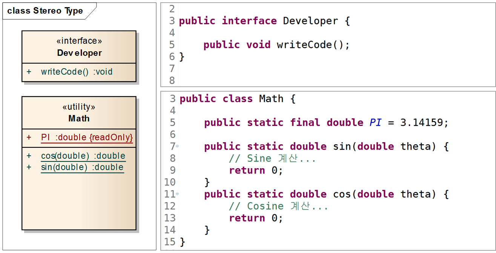

# UML

## Stereo Type (스테레오 타입)

스테레오 타입이란 UML에서 제공하는 기본 요소 외에 추가적인 확장요소를 나타내는 것으로 쌍 꺾쇠와 비슷하게 생긴 길러멧(guillemet, « ») 사이에 적습니다.



## 클라스 관계

클래스 다이어그램의 주 목적은 클래스간의 관계를 한눈에 쉽게 보고 의존 관계를 파악하는 것에 있습니다. 그렇기 때문에 클래스 다이어그램에서 가장 중요한 것이 클래스간의 관계입니다.


1. Generalization (일반화)
    
    Generalization은 슈퍼(부모)클래스와 서브(자식)클래스간의 Inheritance(상속) 관계를 나타냅니다. 
    
    
    

### 2. Realization (실체화)

Realization은 interface의 spec(명세, 정의)만 있는 메서드를 오버라이딩 하여 실제 기능으로 구현 하는 것을 말합니다.


Realization을 나타내는 표기법은 2가지가 있습니다. 첫 번째는 인터페이스를 클래스처럼 표기하고 스테레오 타입 «interface»를 추가합니다. 그리고 인터페이스와 클래스 사이의 Realize 관계는 점선과 인터페이스 쪽의 비어있는 삼각형으로 연결합니다. 두 번째는 인터페이스를 원으로 표기하고 인터페이스의 이름을 명시합니다. 그리고 인터페이스와 클래스 사이의 관계는 실선으로 연결합니다.

### 3. Dependency (의존)

Dependency는 클래스 다이어그램에서 일반적으로 제일 많이 사용되는 관계로서, 어떤 클래스가 다른 클래스를 참조하는 것을 말합니다.


참조의 형태는 메서드 내에서 대상 클래스의 객체 생성, 객체 사용, 메서드 호출, 객체 리턴, 매개변수로 해당 객체를 받는 것 등을 말하며 해당 객체의 참조를 계속 유지하지는 않습니다.

스테레오 타입으로 어떠한 목적의 Dependency인지 의미를 명확히 명시 할 수도 있는데 Dependency의 목적 또는 형태가 중요할 경우 사용할 수도 있을 것 같습니다.


### 4. Association (연관), Directed Association(방향성 있는 연관)

클래스 다이어그램에서의 Association은 보통 다른 객체의 참조를 가지는 필드를 의미합니다. 아래 클래스 다이어그램은 두 가지 형태의 Association을 나타내고 있습니다.


1. 반향성
    - 두 번째 다이어그램은 User에서 Address 쪽으로 화살표가 있으므로 User가 Address를 참조하는 것을 의미합니다.
    - Navigability가 없는 Association은 명시되지 않은 것으로 User가 Address를 참조할 수도, Address가 User를 참조할 수도, 또는 둘 다일 수도 있는 것을 의미합니다.
2. Role 
    - 화살표 옆에 있는 –addresses는 roleName(역할명)을 나타내고 Address가 User 클래스에서 참조될 때 어떤 역할을 가지고 있는지를 의미합니다.
3. Multiplicity(개수)을 나타내는데 대상 클래스의 가질 수 있는 인스턴스 개수 범위를 의미합니다. 
    - 0…1 과 같이 점으로 구분하여 앞에 값은 최소값, 뒤에 값은 최대값을 의미합니다.
    - *은 0…*과 같은 의미로 객체가 없을 수도 있고 또는 수가 정해지지 않은 여러 개일 수도 있다는 것을 의미합니다.
4. 보통은 클래스의 속성이 기본 제공 클래스가 아니거나 중요 또는 강조하고 싶을 때 Association 관계로 나타냅니다. Association Class는 조금 다른 의미로도 사용될 수 있습니다. 
    - 해당 속성을 강조하고 싶을때만 사용

### 5. Aggregation (Shared Aggregation, 집합)

 whole(전체)와 part(부분)의 관계를 나타냅니다. Association은 집합이라는 의미를 내포하고 있지 않지만 Aggregation은 집합이라는 의미를 가지고 있습니다.

표기법은 위와 같이 whole과 part를 실선으로 연결 후 whole쪽에 비어있는 다이아몬드를 표기합니다. Part쪽에는 화살표를 명시하여도 되고 명시하지 않아도 됩니다. 


### 6. Composition (Composite Aggregation, 합성)

Composition(또는 Composite Aggregation)도 Aggregation과 비슷하게 whole(전체)와 part(부분)의 집합 관계를 나타내지만 개념적으로 Aggregation보다 더 강한 집합을 의미합니다.


```java
public class User {
	pirvate List<Address> address = new List<>();
}
```

1. Composition은 Aggregation보다 강한 집합이라고 했습니다. 
    
    여기서 강한 집합이란 part가 whole에 종속적이어서 part가 whole의 소유입니다. 
    
2. 첫 번째, part를 가지는 whole 인스턴스가 part 인스턴스의 전체 수명을 책임진다.
    - whole 인스턴스가 part 인스턴스를 생성
    - whole 인스턴스가 소멸되면 part 인스턴스도 함께 소멸
    - whole 인스턴스가 복사되면 part 인스턴스도 함께 복사
- 두 번째, part에 해당하는 인스턴스는 공유 될 수 없다.

###