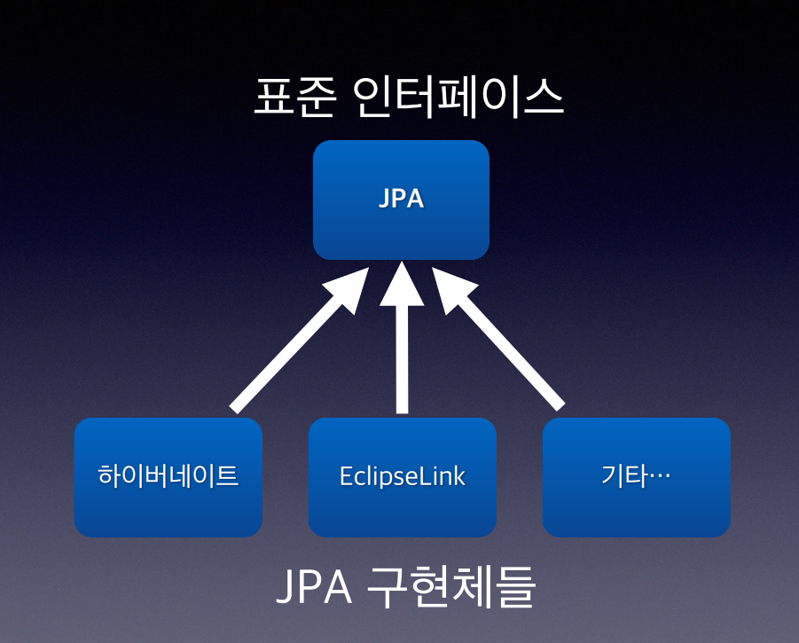

# 스프링 핵심원리 -기본편

### 1. EJB 문제점

- 이론은 좋은데 복잡하고 느리고 어렵다
- EJB에 의존적으로 개발해야함
    
    결과 
    
    1. 스프링 
        
        → EJB 컨테이너 대체
        
        → 단순함의 승리 
        
        → 현재 사실상 표준 기술 
        
    2. 하이버레이트 
        
        → EJB엔티티빈 기술 대체 
        
        → JPA 새로운 표준 정의 
        
        
        

## 2. 스프링의 역사

### 시작

- 2002년 로드 존슨 책 출간
- EJB의 문제점 지적
- EJB 없이도 충분히 고품질의 확장 가능한 애플리케이션을 개발할 수 있음을 보여주고, 30,000라인 이상의 기반 기술을 예제 코드로 선보임
- 여기에 지금의 스프링 핵심 개념과 기반 코드가 들어가 있음
- BeanFactory, ApplicationContext, POJO, 제어의 역전, 의존관계 주입
- 책이 유명해지고, 개발자들이 책의 예제 코드를 프로젝트에 사용
- 책 출간 직후 Juergen Hoeller(유겐 휠러), Yann Caroff(얀 카로프)가 로드 존슨에게 오픈소스 프로젝트를 제안
- 스프링의 핵심 코드의 상당수는 유겐 휠러가 지금도 개발
- 스프링 이름은 전통적인 J2EE(EJB)라는 겨울을 넘어 새로운 시작이라는 뜻으로 지음

### 릴리즈

- 2003년 스프링 프레임워크 1.0 출시 - XML-
- 2006년 스프링 프레임워크 2.0 출시 - XML 편의 기능 지원
- 2009년 스프링 프레임워크 3.0 출시 - 자바 코드로 설정
- 2013년 스프링 프레임워크 4.0 출시 - 자바8
- 2014년 스프링 부트 1.0 출시
- 2017년 스프링 프레임워크 5.0, 스프링 부트 2.0 출시 - 리엑티브 프로그래밍 지원
- 2020년 9월 현재 스프링 프레임워크 5.2.x, 스프링 부트 2.3.x
스프링이란
- 2022년 스프링 6.0 스프링 부트 3.0출시

### 생태계

- 스프링 프레이임워크와 여러 스프링 부트의 기능을 편리하게 사용하게 사용 할 수있는 스프링 트 그리고 스프링 테이타, 스링 세션, 스프링 시큐리티, 스프링 Rest Docs, Batch, 클라우드 들이 있다.

### 스프링 프레임워크

- 핵심 기술: 스프링 DI 컨테이너, AOP, 이벤트, 기타
- 웹 기술: 스프링 MVC, 스프링 WebFlux
- 데이터 접근 기술: 트랜잭션, JDBC, ORM 지원, XML 지원
- 기술 통합: 캐시, 이메일, 원격접근, 스케줄링
- 테스트: 스프링 기반 테스트 지원
- 언어: 코틀린, 그루비
- 최근에는 스프링 부트를 통해서 스프링 프레임워크의 기술들을 편리하게 사용

### 스프링 부트

- 스프링을 편리하게 사용할 수 있도록 지원, 최근에는 기본으로 사용
- 단독으로 실행할 수 있는 스프링 애플리케이션을 쉽게 생성
- Tomcat 같은 웹 서버를 내장해서 별도의 웹 서버를 설치하지 않아도 됨
- 손쉬운 빌드 구성을 위한 starter 종속성 제공
- 스프링과 3rd parth(외부) 라이브러리 자동 구성
- 메트릭, 상태 확인, 외부 구성 같은 프로덕션 준비 기능 제공
- 관례에 의한 간결한 설정

### 스프링 단어?

스프링이라는 단어는 문맥에 따라 다르게 사용된다

- 스프링 DI 컨테이너 기술
- 스프링 프레임워크
- 스프링 부트, 스프링 프레임워크 등을 모두 포함한 스프링 생태계
스프링은 왜 만들었나요

### 스프링은 왜 만들었나요? →  스프링의 진짜 핵심

- 스프링은 객체 지향 언어가 가진 강력한 특징을 살려내는 프레임워크
- **스프링은 좋은 객체 지향 애플리케이션을 개발할 수 있게 도와주는 프레임워크**
    
    **좋은 객체 지향 프로그래밍**
    

## 3.좋은 객체 지향 프로그래밍?

### 객체 지향 특징

- 추상화
- 캡슐화
- 상속
- 다형성

### 객체 지향 프로그래밍

- 객체 지향 프로그래밍은 컴퓨터 프로그램을 명령어의 목록으로 보는 시각에서 벗어나 여러
개의 독립된 단위, 즉 "객체"들의 모임으로 파악하고자 하는 것이다. 각각의 객체는 메시지
를 주고받고, 데이터를 처리할 수 있다. (협력)
- 객체 지향 프로그래밍은 프로그램을 유연하고 변경이 용이하게 만들기 때문에 대규모 소프
트웨어 개발에 많이 사용된다
    - 컴포넌트를 쉽고 유연하게 변경하면서 개발할 수 있는 방법  → 다형성 (****Polymorphism)****
    다

### 다형성

역할과 구현으로 세상을 구분

예) 운전자 - 자동차

- 자동차의 역할을 k3, 아반테, 테슬라 모델3 가 구현있다
- 운자자는 k3을 타가다 아반테을 탈 수가 있다
    
    → 자동차에 대한 역할에 대한 구현만  바겼을 뿐이기 때문이다.   자동차가 바껴도 운전자에서 영향을 주지 않는다.  (유연하고 변경 용이)
    
    → 자동차들은 자동차 인테퍼이스 따라서 차동차를 구현하였기 때문에 운전자는 자동차 인테페이스에 대해서만 알면 된다.
    
    - 클라이언트는 내구 구현을 몰라도 된다.
    - 클라이언트에 영향을 주지 않고 새로운 기능을 제공 할 수 있다.
- 역할과 구현으로 세상을 구별하였기 때문 가능

### 다형성의 실세계 비유

예시)

- 운전자 - 자동차
- 공연 무대
- 키보드, 마우스, 세상의 표준 인터페이스들
- 정렬 알고리즘
- 할인 정책 로직
- 역할과 구현을 분리

### 역할과 구현을 분리

역할과 구현으로 구분하면 세상이 단순해지고, 유연해지며 변경도 편리해진다.

- 장점
    - 클라이언트는 대상의 역할(인터페이스)만 알면 된다.
    - 클라이언트는 구현 대상의 내부 구조를 몰라도 된다.
    - 클라이언트는 구현 대상의 내부 구조가 변경되어도 영향을 받지 않는다.
    - 클라이언트는 구현 대상 자체를 변경해도 영향을 받지 않는다
- 자바 언어의 다형성을 활용
    - 역할 = 인터페이스
    - 구현 = 인터페이스를 구현한 클래스, 구현 객체
- 객체를 설계할 때 역할과 구현을 명확히 분리
- 객체 설계시 역할(인터페이스)을 먼저 부여하고, 그 역할을 수행하는 구현 객체 만들기

### 객체의 협력이라는 관계부터 생각

수 많은 객체 클라이언트와 객체 서버는 서로 협력 관계를 가진다.

### 자바 언어의 다형성

오버라이딩 

아래 그림에서 MemberService에서 save 메소스를 호출 할 때 MemberService 에서 MemoryMemberRepositoy 를 구현하여 사용하였을 경우 MemoryMemberRepositoy 의 Save 메소드가 오버라이딩 되어 호출되고 JdbcMemberRepository를 구현하여 사용하였을 겨우 JdbcMemberRepository의 Save 메소드가 오버라이딩되어 호출된다. 

- 다형성으로 인터페이스를 구현한 객체를 실행 시점에 유연하게 변경할 수 있다.
- 물론 클래스 상속 관계도 다형성, 오버라이딩 적용가능

## 다형성의 본직

- 인터페이스를 구현한 객체 인스턴스를 실행 시점에 유연하게 변경할 수 있다.
- 다형성의 본질을 이해하려면 협력이라는 객체사이의 관계에서 시작해야함
- 클라이언트를 변경하지 않고, 서버의 구현 기능을 유연하게 변경할 수 있다

### 역할과 구현을 분리

1.  장점 
- 실세계의 역할과 구현이라는 편리한 컨셉을 다형성을 통해 객체 세상으로 가져올 수 있음
- 유연하고, 변경이 용이
- 확장 가능한 설계
- 클라이언트에 영향을 주지 않는 변경 가능
- 인터페이스를 안정적으로 잘 설계하는 것이 중요역할과 구현을 분
1. 한계 
- 역할(인터페이스) 자체가 변하면, 클라이언트, 서버 모두에 큰 변경이 발생한다.
- 자동차를 비행기로 변경해야 한다면?
- 대본 자체가 변경된다면?
- USB 인터페이스가 변경된다면?
- 인터페이스를 안정적으로 잘 설계하는 것이 중

### 스프링과 객체 지향

- 다형성이 가장 중요하다!
- 스프링은 다형성을 극대화해서 이용할 수 있게 도와준다.
- 스프링에서 이야기하는 제어의 역전(IoC), 의존관계 주입(DI)은 다형성을 활용해서 역할과
구현을 편리하게 다룰 수 있도록 지원한다.
- 스프링을 사용하면 마치 레고 블럭 조립하듯이! 공연 무대의 배우를 선택하듯이! 구현을 편
리하게 변경할 수 있다

## 4. 좋은 객체 지향 설계의 5가지 원칙(SOLID)

- SRP: 단일 책임 원칙(single responsibility principle)
- OCP: 개방-폐쇄 원칙 (Open/closed principle)
- LSP: 리스코프 치환 원칙 (Liskov substitution principle)
- ISP: 인터페이스 분리 원칙 (Interface segregation principle)
- DIP: 의존관계 역전 원칙 (Dependency inversion principle

### SRP 단일 책임 원칙(Single responsibility principle)

- 한 클래스는 하나의 책임만 가져야 한다.-
- 하나의 책임이라는 것은 모호하다.
• 클 수 있고, 작을 수 있다.
• 문맥과 상황에 따라 다르다.-
- 중요한 기준은 변경이다. 변경이 있을 때 파급 효과가 적으면 단일 책임 원칙을 잘 따른 것
- 예) UI 변경, 객체의 생성과 사용을 분리

## OCP 개방-폐쇄 원칙(Open/closed principle)

- 소프트웨어 요소는 확장에는 열려 있으나 변경에는 닫혀 있어야 한다
- 다형성을 활용하서 인터페이스를 구현한 새로운 클래스를 하나 만들어서 새로운 기능을 구현

아래 코드는 구현 객체를 변경하려면 클라이언트 코드를 변경해야 한다

→ OCP 개방-폐쇄 원칙 원칙에 위배된다. 

→ 객체를 생성하고, 연관관계를 맺어주는 별도의 조립, 설정자가 필요하다.

### LSP 리스코프 치환 원칙(Liskov substitution principle)

- 프로그램의 객체는 프로그램의 정확성을 깨뜨리지 않으면서 하위 타입의 인스턴스로 바꿀
수 있어야 한다
- 다형성에서 하위 클래스는 인터페이스 규약을 다 지켜야 한다는 것, 다형성을 지원하기 위
한 원칙, 인터페이스를 구현한 구현체는 믿고 사용하려면, 이 원칙이 필요하다
- 단순히 컴파일에 성공하는 것을 넘어서는 이야기

예) 자동차 인터페이스의 엑셀은 앞으로 가라는 기능, 뒤로 가게 구현하면 LSP 위반, 느리
더라도 앞으로 가야함

### ISP 인터페이스 분리 원칙 (Interface segregation principle)

- 특정 클라이언트를 위한 인터페이스 여러 개가 범용 인터페이스 하나보다 낫다
- 자동차 인터페이스 -> 운전 인터페이스, 정비 인터페이스로 분리
- 사용자 클라이언트 -> 운전자 클라이언트, 정비사 클라이언트로 분리
- 분리하면 정비 인터페이스 자체가 변해도 운전자 클라이언트에 영향을 주지 않음
- 인터페이스가 명확해지고, 대체 가능성이 높아진다

## DIP 의존관계 역전 원칙(Dependency inversion principle)

- 프로그래머는 “추상화에 의존해야지, 구체화에 의존하면 안된다.” 의존성 주입은 이 원칙
을 따르는 방법 중 하나다.
- 쉽게 이야기해서 구현 클래스에 의존하지 말고, 인터페이스에 의존하라는 뜻
- 앞에서 이야기한 역할(Role)에 의존하게 해야 한다는 것과 같다. 객체 세상도 클라이언트
가 인터페이스에 의존해야 유연하게 구현체를 변경할 수 있다! 구현체에 의존하게 되면 변
경이 아주 어려워진다
- Ocp에서 설명한거 처럼 MemberService는 인터페이스에 의존하지만, 구현 클래스도
동시에 의존한다
    
    → MemberRepository m = new MemoryMemberRepository(); (MemberService 클라이언트가 구현 클래스를 직접 선택) 
    
    → DIP 위반
    

### 정리

- 객체 지향의 핵심은 다형성
- 다형성 만으로는 쉽게 부품을 갈아 끼우듯이 개발할 수 없다.
- 다형성 만으로는 구현 객체를 변경할 때 클라이언트 코드도 함께 변경된다.
- 다형성 만으로는 OCP, DIP를 지킬 수 없다.
- 뭔가 더 필요하다

### 5. 객체 지향 설계와 스프링

- 스프링은 다음 기술로 다형성 + OCP, DIP를 가능하게 지원
    - DI(Dependency Injection): 의존관계, 의존성 주입
    - DI 컨테이너 제공
- 클라이언트 코드의 변경 없이 기능 확장
    - 쉽게 부품을 교체하듯이 개발